# Best GitHub Profile READMEs

## What is this Project?

**"Best GitHub Profile READMEs"** is a curated list of **Beautiful** and **Unique** GitHub Profile **Readme** files.

[This website](https://maxontech.github.io/best-github-profile-readme/) showcases all the Profiles. Under each profile you'll see a link to the persons GitHub account and Readme file.

I encourage everyone to contribute to this project by **adding profiles** or **fixing bugs**. To learn more about how to contribute  [click here](#contribute-to-the-list).

**Support:**
 
Star 🌟 the Project: 
 
Follow 🤝 on GitHub: 
 

**Fun fact:** 
 
The [website](https://maxontech.github.io/best-github-profile-readme/) is fully automized. Profiles that are added to the [markdown list below](#best-profiles-readmes) via approved Pull Requests are automatically added to the [website](https://maxontech.github.io/best-github-profile-readme/) using GitHub actions.

## Table of Contents

- [Best GitHub Profile READMEs](#best-github-profile-readmes)
  - [What is this Project?](#what-is-this-project)
  - [Table of Contents](#table-of-contents)
  - [Best Profiles READMEs](#best-profiles-readmes)
  - [Contribute](#contribute)
  - [License](#license)

 
    
    

## Best Profiles READMEs

| First Name | Last Name   | GitHub Profile                                          | GitHub Readme                                                  | Preview                                                                                                 |
| ---------- | ----------- | ------------------------------------------------------- | -------------------------------------------------------------- | ------------------------------------------------------------------------------------------------------- |
| Adam       | Alston      | [adamalston](https://github.com/adamalston)             | [README](https://github.com/adamalston/adamalston)             | 
 
Preview
 
       |
| Abhishek   | Choudhary   | [theabbie](https://github.com/theabbie)                 | [README](https://github.com/theabbie/theabbie)                 | 
 
Preview
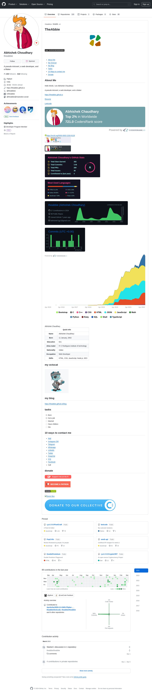 
         |
| Brian      | Douglas     | [bdougie](https://github.com/bdougie)                   | [README](https://github.com/bdougie/bdougie)                   | 
 
Preview
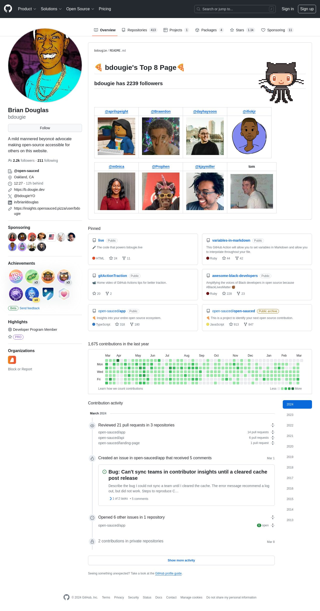 
          |
| Danny      | Koppenhagen | [d-koppenhagen](https://github.com/d-koppenhagen)       | [README](https://github.com/d-koppenhagen/d-koppenhagen)       | 
 
Preview
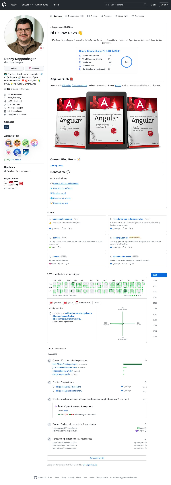 
    |
| Edward     | Thomson     | [ethomson](https://github.com/ethomson)                 | [README](https://github.com/ethomson/ethomson)                 | 
 
Preview
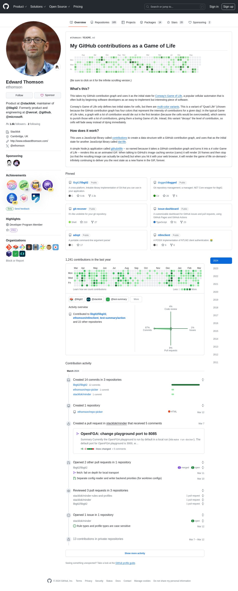 
         |
| Erwin      | Lejeune     | [guilyx](https://github.com/guilyx)                     | [README](https://github.com/guilyx/guilyx)                     | 
 
Preview
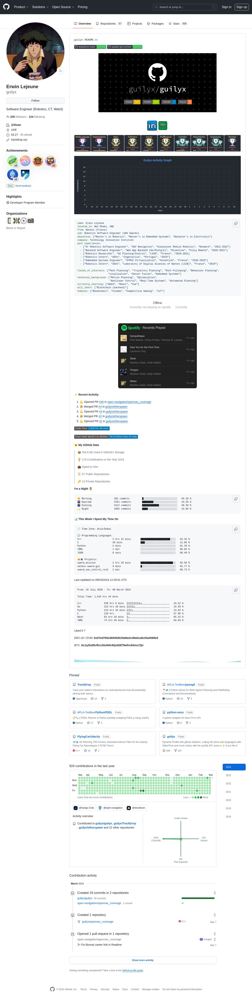 
           |
| Garima     | Singh       | [garimasingh128](https://github.com/garimasingh128)     | [README](https://github.com/garimasingh128/garimasingh128)     | 
 
Preview
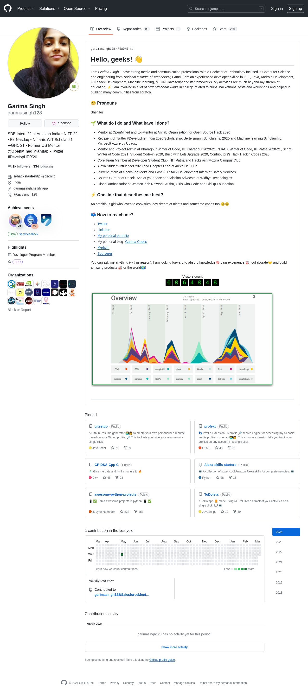 
   |
| Jacob      | Colvin      | [MacroPower](https://github.com/MacroPower)             | [README](https://github.com/MacroPower/MacroPower)             | 
 
Preview
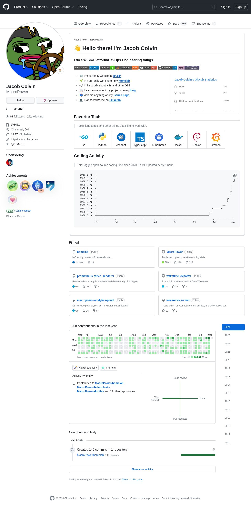 
       |
| Jonathan   | Gin         | [jonathangin52](https://github.com/jonathangin52)       | [README](https://github.com/jonathangin52/jonathangin52)       | 
 
Preview
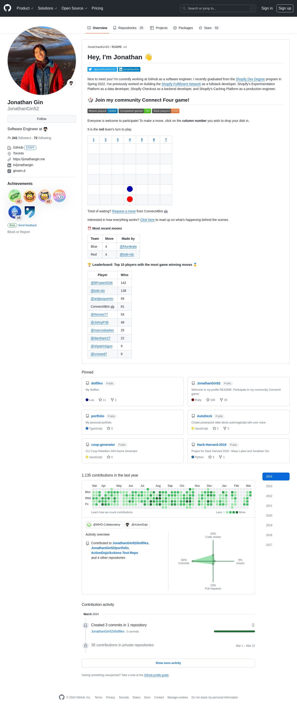 
    |
| Kavish     | Hukmani     | [DoubleGremlin181](https://github.com/DoubleGremlin181) | [README](https://github.com/DoubleGremlin181/DoubleGremlin181) | 
 
Preview
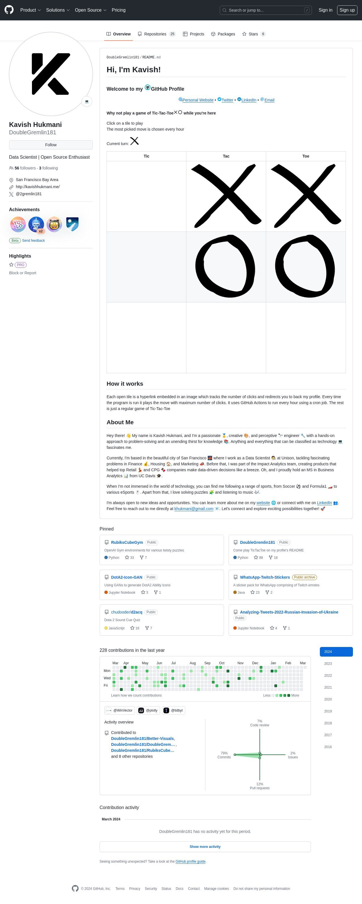 
 |
| Lee        | Reilly      | [leereilly](https://github.com/leereilly)               | [README](https://github.com/leereilly/leereilly)               | 
 
Preview
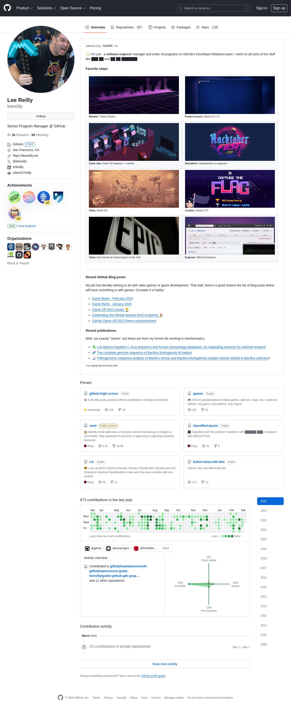 
        |
| Max        | Rohowsky    | [maxontech](https://github.com/maxontech)               | [README](https://github.com/maxontech/maxontech)               | 
 
Preview
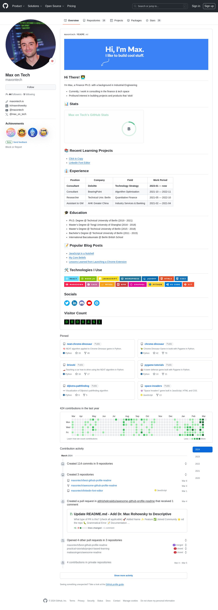 
        |
| Michael    | Hoffmann    | [mokkapps](https://github.com/mokkapps)                 | [README](https://github.com/mokkapps/mokkapps)                 | 
 
Preview
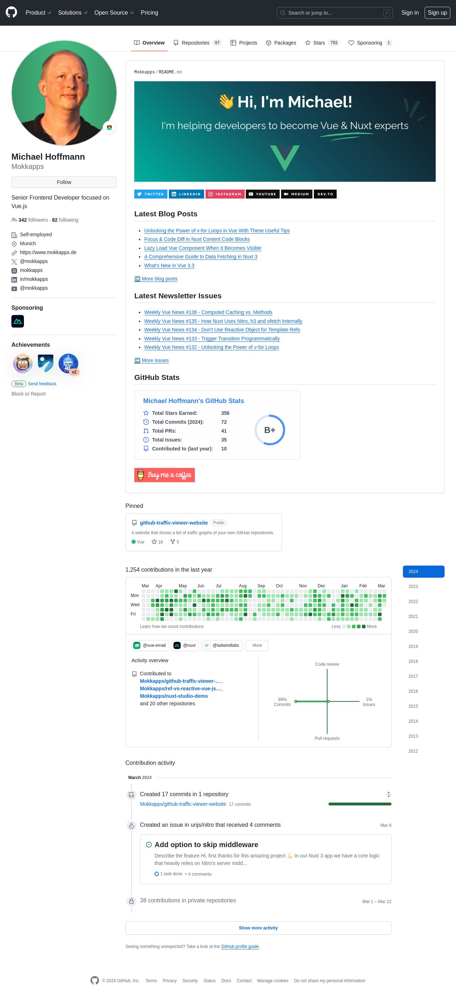 
         |
| Monica     | Powell      | [M0nica](https://github.com/M0nica)                     | [README](https://github.com/M0nica/M0nica)                     | 
 
Preview
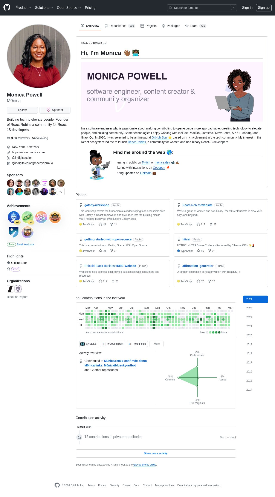 
           |
| Nate       | Moore       | [natemoo-re](https://github.com/natemoo-re)             | [README](https://github.com/natemoo-re/natemoo-re)             | 
 
Preview
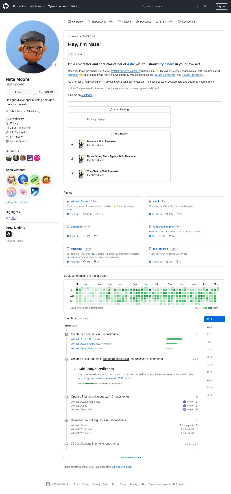 
       |
| Osman      | Durdağ      | [zumrudu-anka](https://github.com/zumrudu-anka)         | [README](https://github.com/zumrudu-anka/zumrudu-anka)         | 
 
Preview
 
     |
| Rahul      | Jha         | [rahul-jha98](https://github.com/rahul-jha98)           | [README](https://github.com/rahul-jha98/rahul-jha98)           | 
 
Preview
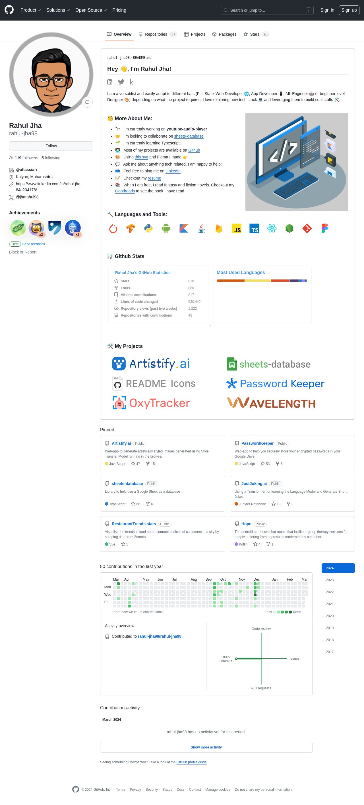 
      |
| Raymond    | Li          | [Raymo111](https://github.com/Raymo111)                 | [README](https://github.com/Raymo111/Raymo111)                 | 
 
Preview
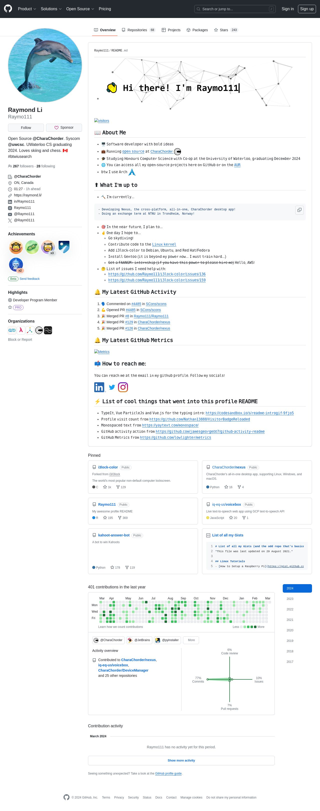 
         |
| Ross       | Williams    | [rossjrw](https://github.com/rossjrw)                   | [README](https://github.com/rossjrw/rossjrw)                   | 
 
Preview
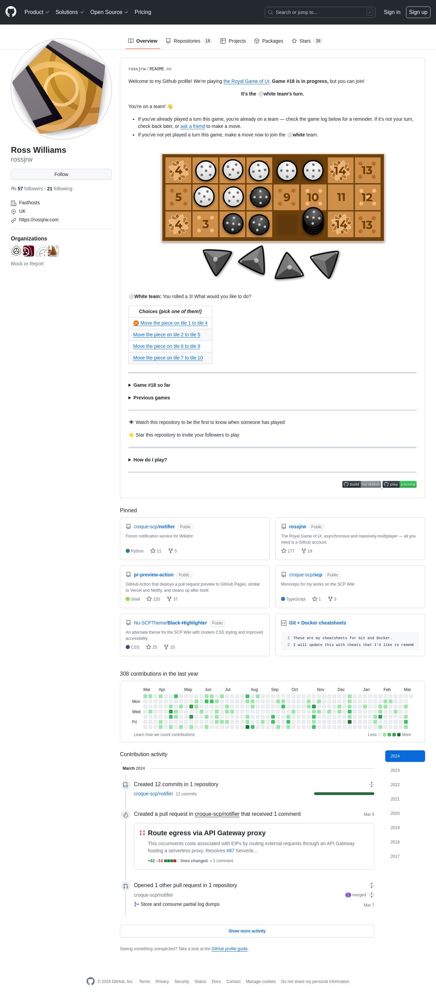 
          |
| Sagar      | Viradiya    | [sagar-viradiya](https://github.com/sagar-viradiya)     | [README](https://github.com/sagar-viradiya/sagar-viradiya)     | 
 
Preview
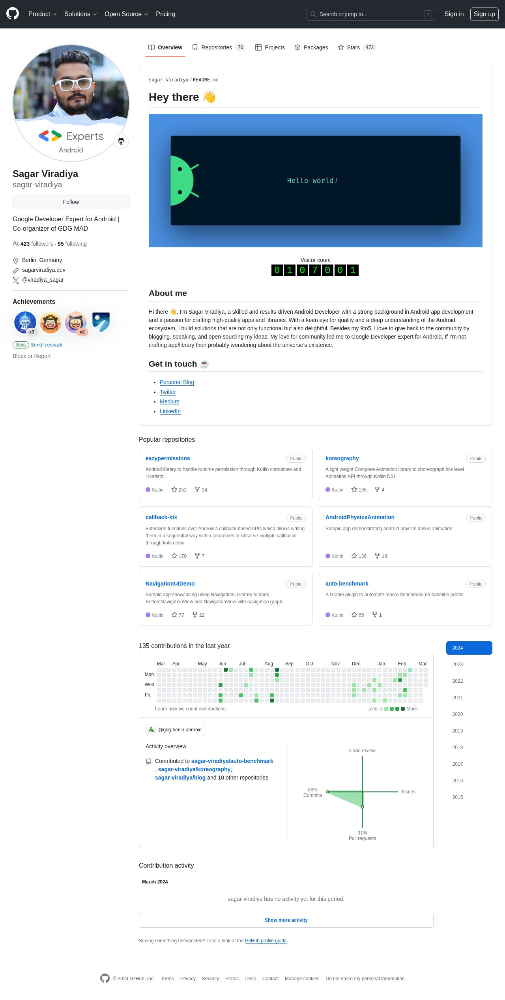 
   |
| Taehyun    | Hwang       | [HwangTaehyun](https://github.com/HwangTaehyun)         | [README](https://github.com/HwangTaehyun/HwangTaehyun)         | 
 
Preview
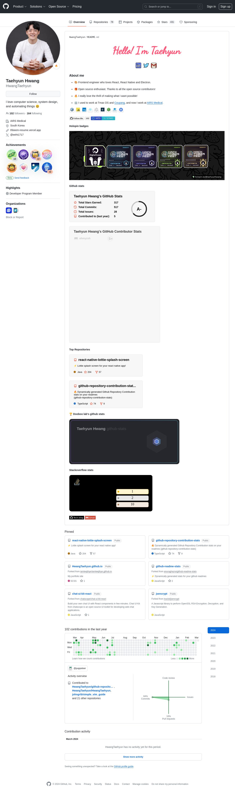 
     |
| Tim        | Burgan      | [timburgan](https://github.com/timburgan)               | [README](https://github.com/timburgan/timburgan)               | 
 
Preview
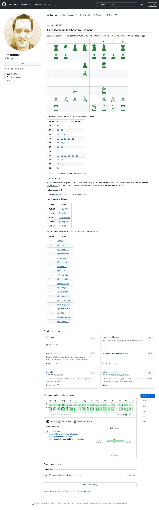 
        |
| Tushar     | Mittal      | [techytushar](https://github.com/techytushar)           | [README](https://github.com/techytushar/techytushar)           | 
 
Preview
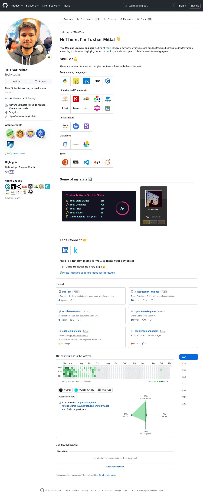 
      |
| Yufan      | You         | [ouuan](https://github.com/ouuan)                       | [README](https://github.com/ouuan/ouuan)                       | 
 
Preview
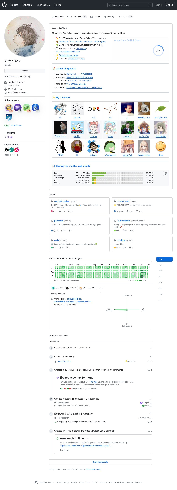 
            |
| Zach       | Nguyen      | [cszach](https://github.com/cszach)                     | [README](https://github.com/cszach/cszach)                     | 
 
Preview
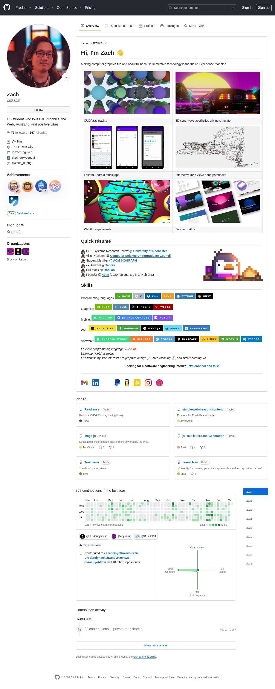 
           |
| Raghav     | Khullar     | [RaghavK16](https://github.com/RaghavK16)               | [README](https://github.com/Raghav16/Raghav16)                 | 
 
Preview
 
         |
| Ari        | Hacks       | [ari-hacks](https://github.com/ari-hacks)               | [README](https://github.com/ari-hacks/ari-hacks)               | 
 
Preview
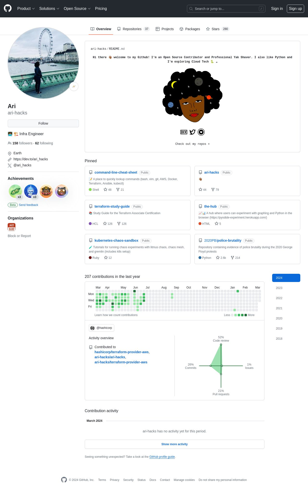 
        |
| Ileriayo   | Adebiyi     | [Ileriayo](https://github.com/Ileriayo)                 | [README](https://github.com/Ileriayo/Ileriayo)                 | 
 
Preview
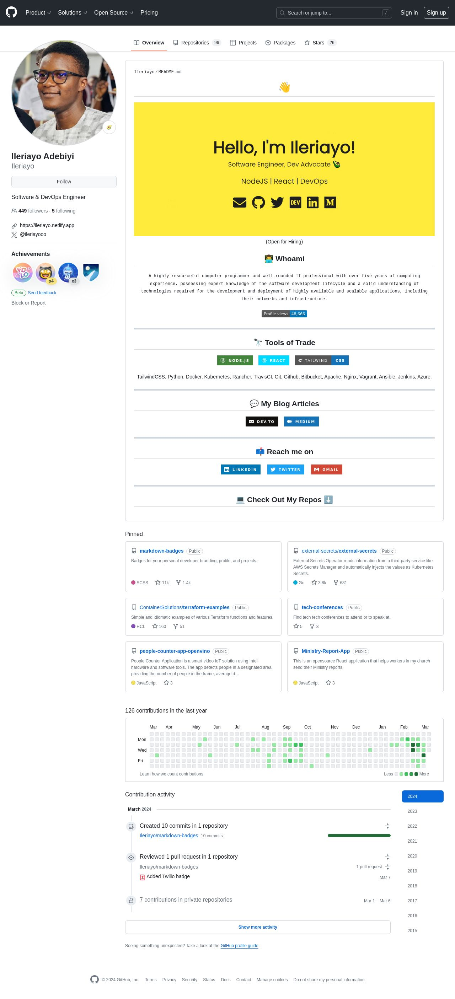 
         |
| Robert     | Shaw        | [xiaoluoboding](https://github.com/xiaoluoboding)       | [README](https://github.com/xiaoluoboding/xiaoluoboding)       | 
 
Preview
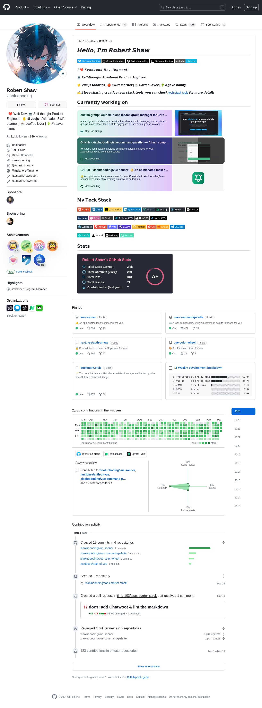 
    |
| Ritik      | Rawal       | [ritik307](https://github.com/ritik307)                 | [README](https://github.com/ritik307/ritik307)                 | 
 
Preview
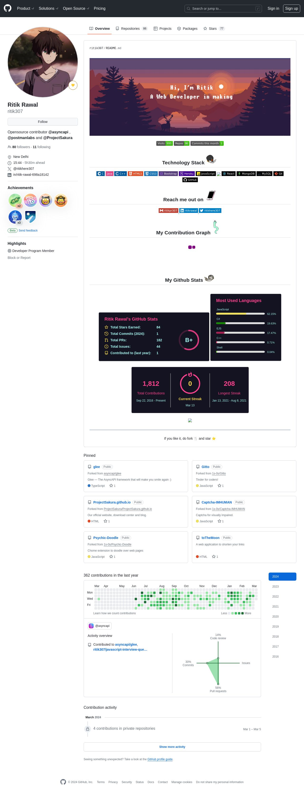 
         |
| Muhammedh  | Shadir      | [muhammedh-shadir](https://github.com/muhammedh-shadir) | [README](https://github.com/muhammedh-shadir/muhammedh-shadir) | 
 
Preview
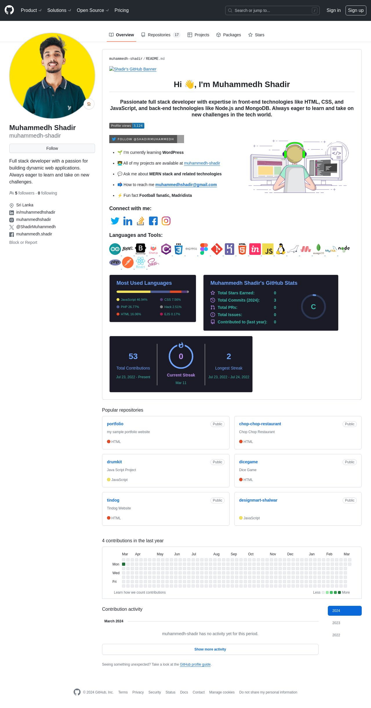 
 |
| Thaiane    | Braga       | [thaiane](https://github.com/thaiane)                   | [README](https://github.com/thaiane/thaiane)                   | 
 
Preview
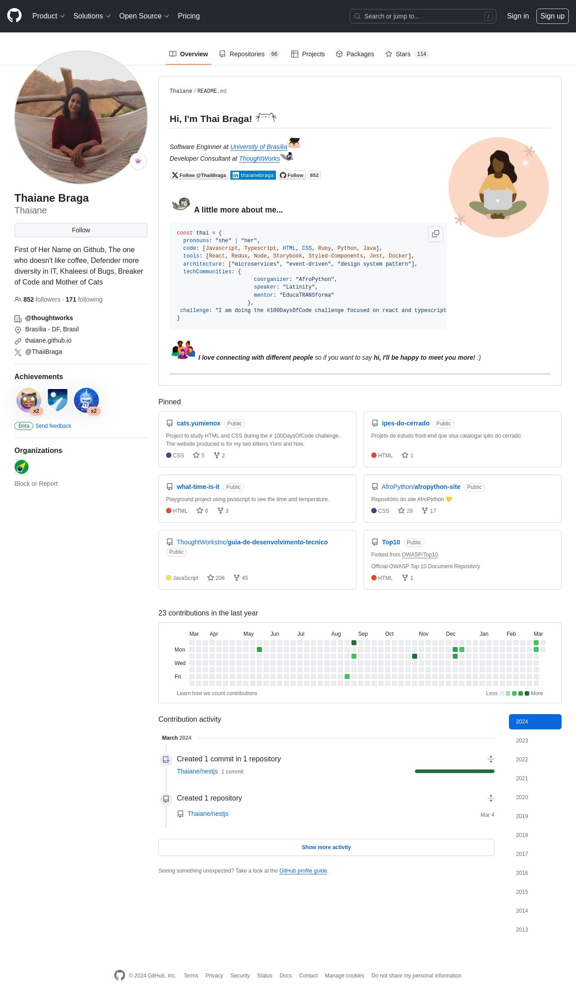 
          |
| Gaurav     | Pandey      | [codewithgauri](https://github.com/codewithgauri)       | [README](https://github.com/codewithgauri/codewithgauri)       | 
 
Preview
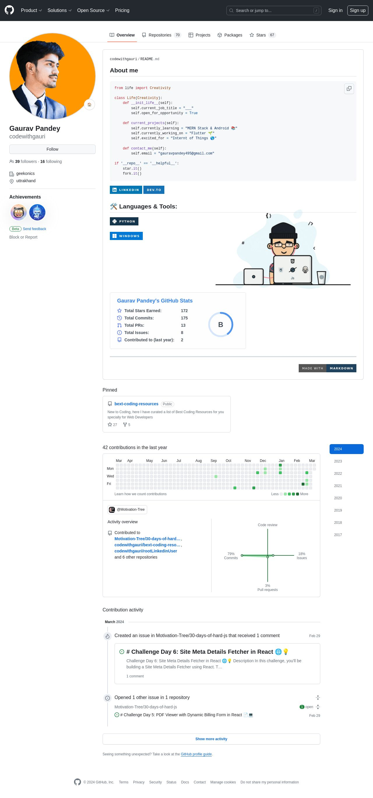 
    |
| Lakshmanan | Meiyappan   | [laxmena](https://github.com/laxmena)                   | [README](https://github.com/laxmena/laxmena)                   | 
 
Preview
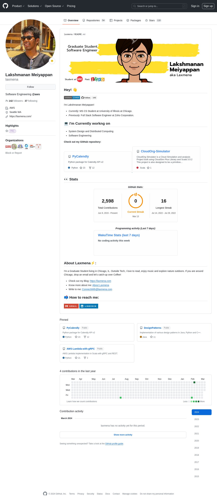 
          |
| Karim      | Abdallah    | [karim-eg](https://github.com/karim-eg)                 | [README](https://github.com/karim-eg/karim-eg)                 | 
 
Preview
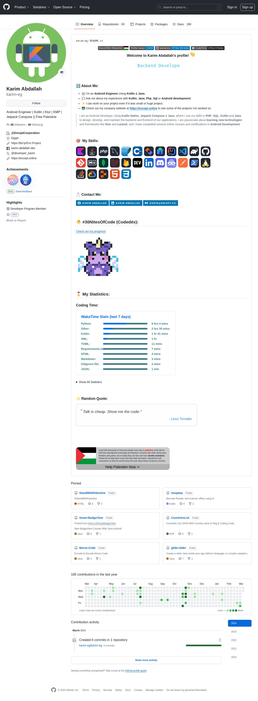 
         |
| Livio      | Brunner     | [BrunnerLivio](https://github.com/BrunnerLivio)         | [README](https://github.com/BrunnerLivio/BrunnerLivio)         | 
 
Preview
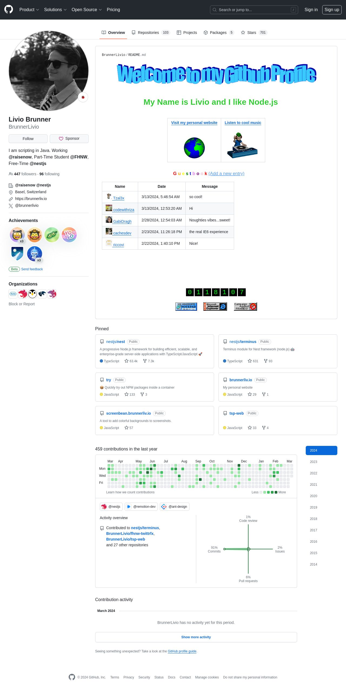 
     |
| Code       | Bullet      | [Code-Bullet](https://github.com/Code-Bullet)           | [README](https://github.com/Code-Bullet/Code-Bullet)           | 
 
Preview
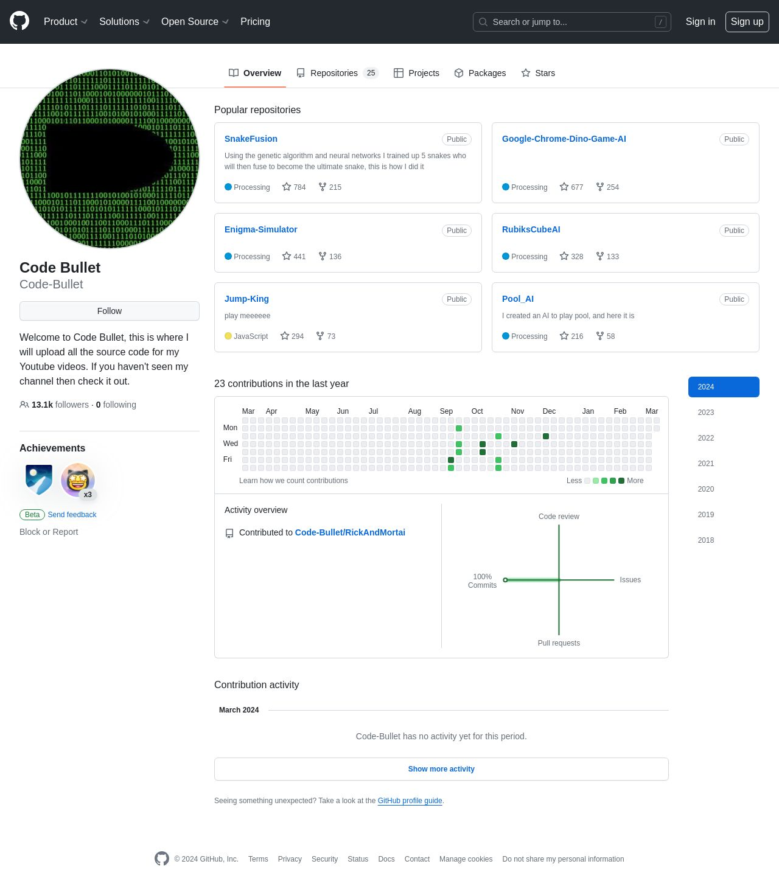 
      |
| Emil       | Widlund     | [emilwidlund](https://github.com/emilwidlund)           | [README](https://github.com/emilwidlund/emilwidlund)           | 
 
Preview
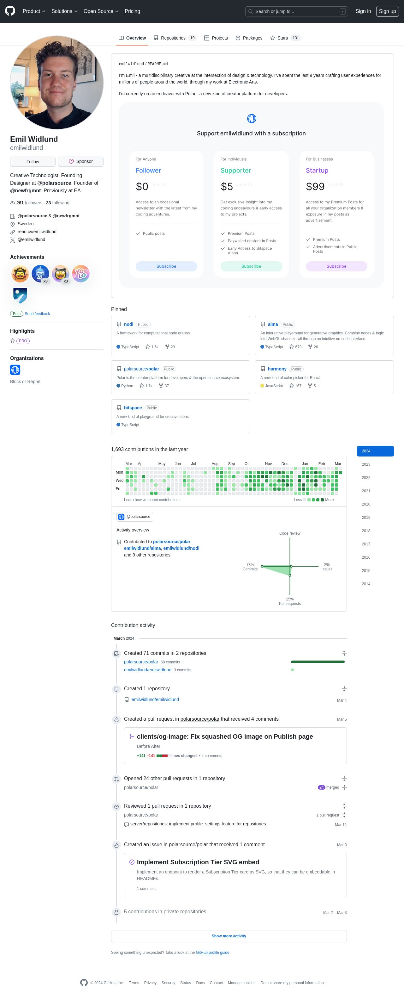 
      |
| Terkel     | Gjervig     | [terkelg](https://github.com/terkelg)                   | [README](https://github.com/terkelg/terkelg)                   | 
 
Preview
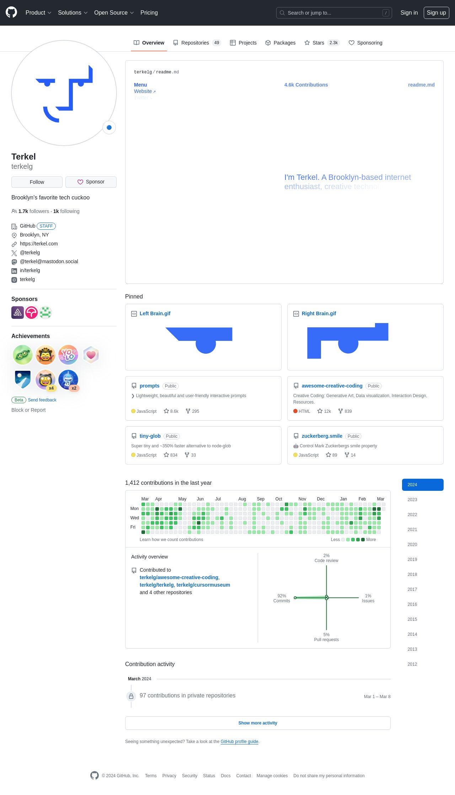 
          |
| Avinal     | Kumar       | [avinal](https://github.com/avinal)                     | [README](https://github.com/avinal/avinal)                     | 
 
Preview
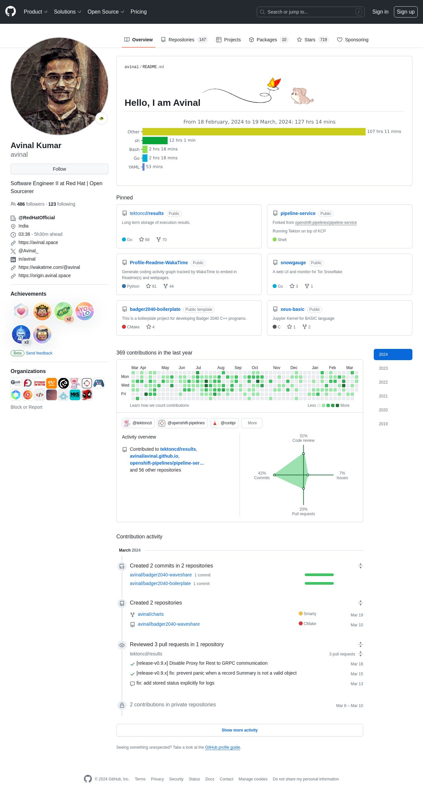 
           |
| Suman      | Shekhar     | [sumanshekhar698](https://github.com/sumanshekhar698)   | [README](https://github.com/sumanshekhar698/sumanshekhar698)   | 
 
Preview
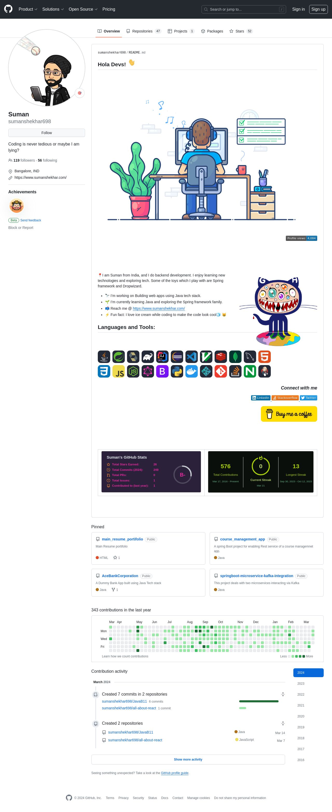 
  |
| Syed       | Ibrahim     | [syedibrahim](https://github.com/syedibrahim)           | [README](https://github.com/syedibrahim/syedibrahim)           | 
 
Preview
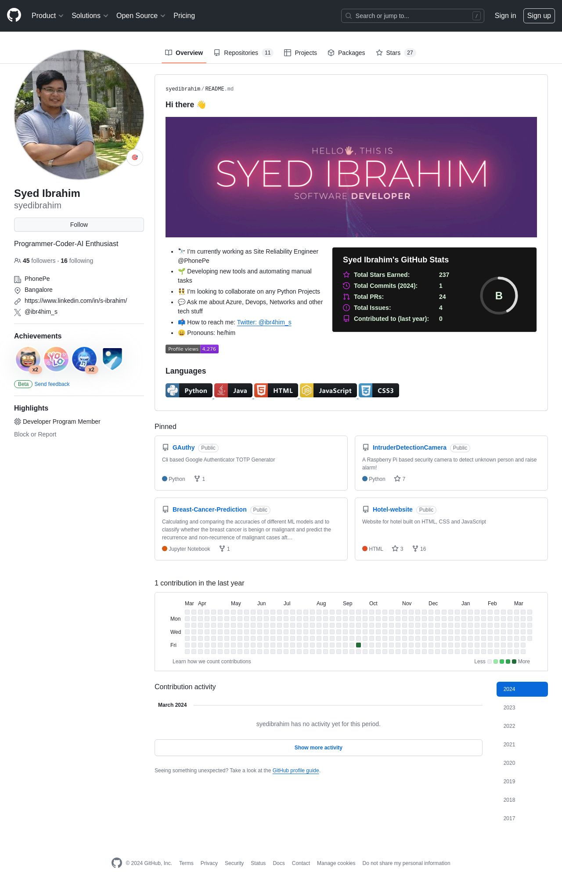 
      |
| Siby       | Lassana     | [sibylassana95](https://github.com/sibylassana95)       | [README](https://github.com/sibylassana95/sibylassana95)       | 
 
Preview
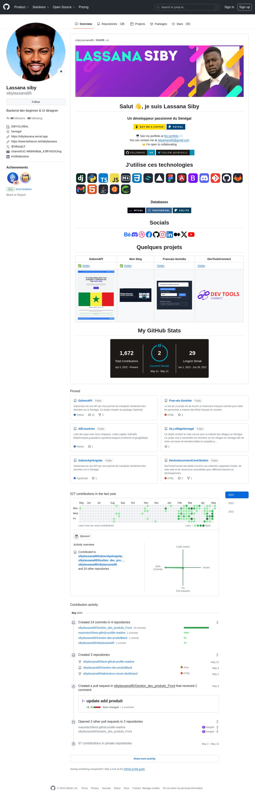 
    |

## Contribute

We encourage you to contribute to "Best GitHub Profile READMEs"!

Please check out the [Contributing guide](CONTRIBUTING.md) for guidelines about how to proceed.

Let's make this the most popular source for GitHub Profile Inspiration!

## License

This project is licensed under the [MIT License](https://opensource.org/licenses/MIT). Feel free to modify and distribute it for your own purposes.
